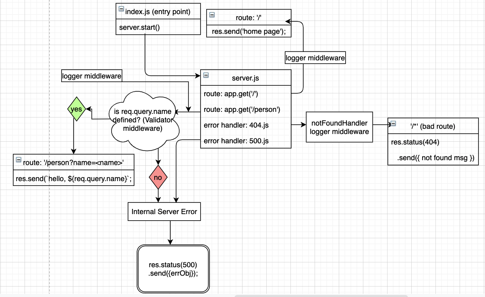

# LAB: Express

Dynamic API Phase 1: Build your core, standards compliant Express server

**Author:** Afnan Damra
**Version:** 1.0.0

**Links:**

- [Repo Link](https://github.com/afnandamra/basic-express-server)
- [GitHub Actions](https://github.com/afnandamra/basic-express-server/actions)
- [Deployed Site](https://afnan-express-server.herokuapp.com/)

## Setup

### Install

- Clone the repository from GitHub
- Run the command `npm i dotenv express jest supertest` to install dependencies
- create .env file with PORT variable

### Test

- Run the command `npm test` to test and verify the server and the midddlewares are working

### Run

- Start the server using `nodemon`
- Visit http://localhost:PORT at the PORT number you've assigned in your .env

## Documentation

### UML Diagram
